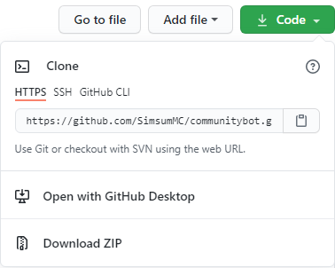

# CommunityBot Beta (Release with 24/7 Hosting on 21.04.)

**Der Deutsche Bot für die Community!** 
 

**Wieso solltest du ihn nutzen?** 
+ Open Source 
+ Clean Code 
+ viele Befehle 
+ komplett konfigurierbar per Befehl 
+ wird stetig weiterentwickelt 
+ viele Aliasse für die Befehle 
+ Groß - und Kleinschreibung wird ignoriert  
+ in Python geschrieben - leicht erweiterbar 

**Einrichtung:** 

--24/7 Hosting-- 

+Invite-Link: ... comming soon... 

--Eigenständiges Hosting-- 

Nur für Profis empfohlen!

Benötigtes Programm:
+ Notepad ++

1. Laden sie sich den Ordner herunter und entpacken sie ihn 
 
2. Gehen sie in den venv Ordner und öffnen sie das Dokument "pyvenv.cfg" mit Notepad ++ 
3. Änderen sie in der ersten Zeile den Pfad zu ihren Python Pfad und in der unteren Zeile zu ihrer Python Version 
4. Gehen sie in die "main.py" und änderen sie in der untersten Zeile ("client.run(Token)") den Token zu ihrem Bot Token 
5. Nun können sie den Bot starten und natürlich auch den Code bearbeiten  

**Commands:** 

Allgemein: 
!hilfe - Zeigt dir eine Übersicht aller Hilfeseiten! 
!qr - Erstelle einen QR Code zu einer beliebigen Website! 
!Invite - Schau bei meinem Zuhause vorbei! 
!ping - Zeigt dir meinen Ping an! 

Unterhaltung: 
!würfel - Nutze meinen integrierten Würfel! 
!ssp - Spiele Schere, Stein, Papier gegen mich! 
  -> !schere / !stein / !papier - einzelne RUnden sind möglich! 
!meme - Zeigt dir einen zufälligen Meme von Reddit! 

Moderation: 
!clear (Anzahl) - Lösche eine bestimmte Anzahl an Nachrichten!v
!ban (Member) (optional Grund) - Banne einen bestimmten Spieler bis er entbannt wird! 
!unban (Member) - Entbanne einen zuvor gebannten Spieler! 
!kick (Member) (optional Grund) - Kicke einen bestimmten Spieler! 

Administration 
!channelclear - Lösche alle Nachrichten aus einem Channel! 
!config hilfe - Ändere die Botkonfiguration über einen Befehl! 

Geplante Befehle: 
!report (Member) (Reason) > mit konfigurierbarem Mod Channel 
!server ("hilfe" / "top" / modus) - Top Server allgemein oder die perfekten Server für einen Modus 

