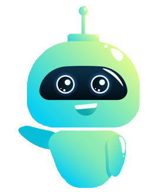

<h1 align="center">
   
   
   
  Community Bot 
   
</h1> 

<h4 align="center">Moderation, Informationen, Music (in Arbeit) uvm.</h4>

  
  
  
  
  

  <a href="#übersicht">Übersicht</a>
  •
  <a href="#installation">Installation</a>
  •
  <a href="#funktionen">Funktionen</a>
  •
  <a href="#lizenz">Lizenz</a>

# Übersicht

Der Community Bot ist ein Discord Bot mit dem Ziel alles in einem Bot zu vereinen, es ist natürlich klar das es immer ein zwei Bots gibt die man einfach nicht ersetzen kann, trotzdem sind wir der Meinung, dass man nicht 5 Bots für jeweils eine Funktion braucht. Wir wollen auch nicht, dass man für Funktionen wie z.B. das ändern des Präfix's Geld zahlen muss. Du kannst ihn zum Spielen, zur Moderation oder auch bald zum Musik hören nutzen! Wenn dich das Konzept überzeugt, dann [teste](https://discord.com/oauth2/authorize?client_id=802922765782089738&scope=bot&permissions=2620914775) ihn direkt aus! 

Die [Installation](#installation) zum Self-Hosting ist sehr einfach gestaltet und du benötigst dafür keine großen Vorkentnisse.

**Vorteile:**

- Open Source 
- 24/7 Hosting mit kurzen Wartungen
- Botlog über die Nutzungen des Bots
- Komplett konfigurierbar über Discord
- Wird stetig weiterentwickelt
- Groß - und Kleinschreibung wird ignoriert
- In Python geschrieben - leicht erweiterbar mit Cogs

# Installation

**Folgende Betriebssysteme werden offiziell unterstützt:** 

- Windows
- alle großen Linux Distributionen

**Erforderliche Programme:**

- Python 3.7 oder höher

**Universelle Installation**

1. Laden sie sich den Ordner herunter und entpacken sie ihn
2. Gehen sie in den venv Ordner und öffnen sie das Dokument "pyvenv.cfg" mit Notepad ++ oder einem anderem Editor
3. Ändern sie in der ersten Zeile den Pfad zu ihren Python Pfad und in der unteren Zeile zu ihrer Python Version
4. Gehen sie in die "main.py" und änderen sie in der untersten Zeile ("client.run(Token)") den Token zu ihrem Bot Token
5. Nun können sie den Bot starten und natürlich auch den Code modifizieren

# Funktionen

**Allgemein**
- Infos über den Bot (Ping, Server, Nutzer etc.) und Invite Links zum Bot 
- QR Codes erstellen 

**Informationen**
- Informationen zu einzelnen Nutzern
- Informationen zu dem aktuellen Server

**Unterhaltung**
- Würfel Befehl (1-6) 
- Schere Stein Papier
- Zufälligen Meme per Command

**Moderation**
- Slomode eines Channels setzen
- Bestimmte Anzahl an Nachrichten löschen
- Spieler Muten / Entmuten
- Spieler Bannen / Entbannen
- Spieler Kicken

**Administration**
- Farbe von Embeds, Präfix, Meme bzw. Bot Channel festlegen mit dem config Befehl
- Kompletten Channel "leeren"
- Botlog ausgeben

# Lizenz

"Die GNU General Public License (kurz GNU GPL oder GPL; aus dem Englischen wörtlich für allgemeine Veröffentlichungserlaubnis oder -genehmigung) ist die am weitesten verbreitete Softwarelizenz, die einem gewährt, die Software auszuführen, zu studieren, zu ändern und zu verbreiten (kopieren). Software, die diese Freiheitsrechte gewährt, wird Freie Software genannt; und wenn die Software einem Copyleft unterliegt, so müssen diese Rechte bei Weitergabe (mit oder ohne Software-Änderung, -Erweiterung, oder Softwareteile-Wiederverwendung) beibehalten werden. Bei der GPL ist beides der Fall." Quelle: [Wikepedia](https://de.wikipedia.org/wiki/GNU_General_Public_License)

Demnach hast du die Erlaubnis, :

- den Code für alle Zwecke zu nutzen (sowhol kommerziell als auch privat)
- den Code nach den Bedingungen der Lizenz kopieren, weiterverbreiten und ändern
